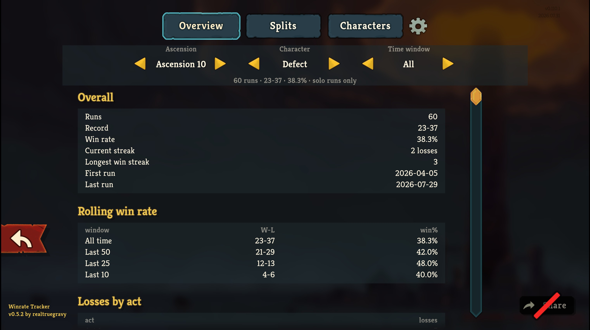

# Winrate Tracker

A Slay the Spire 2 mod that reads your own run history and reports how often you actually
win — over time, and split by month, by patch, by run block, and by character.

It adds a **Win Rates** tile to the Compendium, beside Statistics and Run History.

## What it does

Five tabs — an **Overview** with your record, streaks and a rolling win rate; **Splits**,
which cuts the same archive up several ways and will graph any of them; **Characters**,
per character and over recent runs; and **Cards** and **Relics**, ranking everything you
have picked up by how often the runs that took it went on to win. A filter row narrows the
whole screen by ascension, character, and time window, and the pick tabs add a minimum and
a rarity of their own.

The numbers come from the `.run` files the game already writes for every finished run, so
nothing needs enabling first and runs from before you installed the mod are included.
Reading them happens off the main thread and is cached, so the screen opens without a
stutter.

Everything works with mouse and keyboard or with a gamepad.

## Installing

Subscribe on the [Steam Workshop][workshop]. Requires Slay the Spire 2 v0.110 or newer.

## Building

See [docs/development.md](docs/development.md).

## Licence

MIT — see [LICENSE](LICENSE).

That covers this mod's own source. It does not cover Slay the Spire 2, which is the
property of Mega Crit. The mod compiles against the game's assemblies and loads the game's
own scenes and textures at runtime from the player's installed copy; none of that is
redistributed here.

[workshop]: https://steamcommunity.com/sharedfiles/filedetails/?id=3775014144
